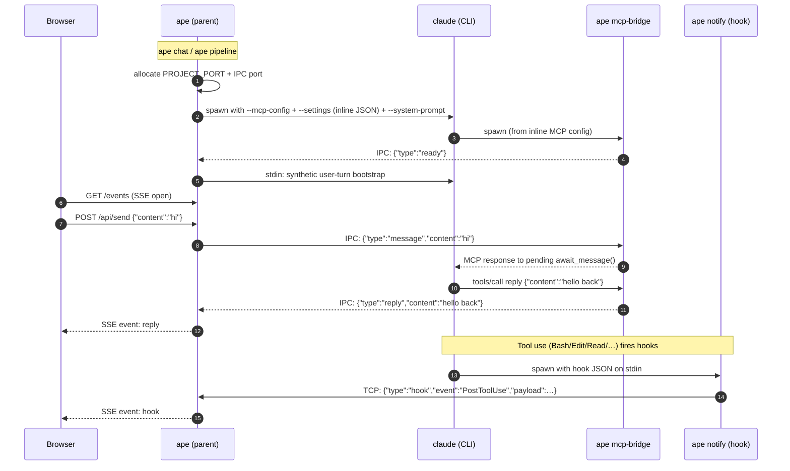

# Claude MCP Bridge

## Context

`ape pipeline` currently spawns one `claude -p "/{skill} --autonomous ..."` subprocess per
pipeline step — a fresh billed API call per step, no shared context across steps.

The fix is **one phase**: keep `ape` as the orchestrator (it already spawns one
`claude` process per pipeline step today), add a web bridge that attaches to each step's
session for live progress, hooks for passive observability, and an `ape chat` mode for
interactive bridge sessions.

This is a deliberate reframing of the earlier two-phase plan. The original Phase 1 put an
in-Claude conductor skill (using the Agent tool) at the centre, which had two fatal flaws:

1. **Sub-agent nesting limit.** Claude Code allows only one level of sub-agents.
   `apex-story-batch-dev`, `apex-story-batch-create`, `apex-lift-project` are already
   orchestrators that fan out to per-story sub-agents — they cannot run _under_ another
   Agent layer. An in-Claude conductor would block these from being pipeline steps.
2. **Shared-context benefit collapsed** under the new 5-minute prompt-cache TTL
   ([Anthropic dropped the default from 1 h to 5 min around March 2026](https://dev.to/whoffagents/claudes-prompt-cache-ttl-silently-dropped-from-1-hour-to-5-minutes-heres-what-to-do-13co)).
   A 13-step pipeline cannot share context within one cache window anyway; per-step
   sessions pay the same re-cache cost as a single long session.

So `ape` continues to spawn one `claude` invocation per pipeline step (the current model).
The bridge + hooks make that observable; `ape chat` is the new interactive-session entry
point. This document covers the full architecture.

## Why Not Channels

Claude Code channels (`notifications/claude/channel`) were investigated first. They allow an
MCP server to push events into a running Claude session passively. However:

- Channels are in research preview and require Anthropic backend provisioning.
- The admin org toggle (`claude.ai → Admin settings → Claude Code → Channels`) is a
  pre-authorization signal — it does not self-activate the feature.
- Confirmed unavailable on Claude Team and Claude Max plans (Claude Code v2.1.143) after
  enabling the org toggle and doing a full logout/login.
- No self-serve path exists to unblock this during the research preview.

Full investigation recorded in [`claude-channel-bridge.md`](claude-channel-bridge.md).

## The MCP Blocking-Tool Approach

Standard MCP tool calls flow one way: Claude calls a tool, the MCP server responds.
A **blocking tool call** makes this bidirectional:

1. Claude calls `await_message()` — the MCP server does **not** respond immediately.
2. The MCP server holds the pending request ID in memory.
3. The user types in the Web UI → browser POSTs to ape → ape wakes the pending request.
4. MCP server responds to Claude's tool call with the message text.
5. Claude processes it, calls `reply(content)` — ape broadcasts to browser via SSE.
6. Claude calls `await_message()` again — loop.

No channels capability, no platform provisioning, no special Claude Code version required.
Works on any plan today with standard MCP.

## The Two Tools

### `await_message`

```json
{
  "name": "await_message",
  "description": "Block until a message arrives from the Web UI. Returns the message text. Call this in a loop to handle the interactive session.",
  "inputSchema": {
    "type": "object",
    "properties": {
      "timeout_seconds": {
        "type": "integer",
        "description": "Seconds to wait before returning an empty string. Default 240 (under the 5-minute prompt-cache TTL).",
        "default": 240
      }
    }
  }
}
```

Default is **240 s** so each wake-cycle lands inside the 5-minute prompt-cache TTL
([Anthropic prompt caching](https://docs.claude.com/en/docs/build-with-claude/prompt-caching)):
the next turn after a timed-out `await_message` reads the cached prefix at 0.1× input rate
instead of paying the 1.25× cache-creation cost.

**Return on message:** `{"content": [{"type": "text", "text": "<user message>"}], "isError": false}`

**Return on timeout:** `{"content": [{"type": "text", "text": ""}], "isError": false}`

The empty string signals Claude that no message arrived within the timeout. The skill/session
decides what to do: idle-check, send a heartbeat, or exit the loop gracefully.

### `reply`

```json
{
  "name": "reply",
  "description": "Send a message to the Web UI immediately. Use this to respond to the user or report pipeline progress.",
  "inputSchema": {
    "type": "object",
    "properties": {
      "content": { "type": "string", "description": "Text to display in the Web UI." }
    },
    "required": ["content"]
  }
}
```

Non-blocking. Returns immediately with `{"content": [{"type": "text", "text": "sent"}]}`.

## Entry points

| Command                  | Mode                                              | TUI? | Web bridge? | Use case                                                                        |
| ------------------------ | ------------------------------------------------- | ---- | ----------- | ------------------------------------------------------------------------------- |
| `ape chat`               | One interactive Claude session, bridged to Web UI | no   | **yes**     | Free-form interactive work surfaced in the browser instead of the terminal.     |
| `ape pipeline <name>`    | Sequential per-step `claude` invocations          | no   | **yes**     | Default. Each step's session is bridged for live progress.                      |
| `ape pipeline --tui …`   | Sequential per-step `claude` invocations          | yes  | no          | Opt-in to the current Bubble Tea TUI (today's default; flipped in this design). |
| `ape pipeline --print …` | Sequential per-step `claude` invocations          | no   | no          | Plain stdout, no UI surface. CI / scripted runs.                                |

`ape chat` is one bridged session. `ape pipeline` is N bridged sessions in sequence,
sharing the same browser surface across steps. The `--tui` flip from default-on to opt-in
is a deliberate breaking UX change — web becomes the primary surface for interactive work.

## Architecture

```
ape (parent process)
├── Web UI HTTP server         :PROJECT_PORT   browser ← SSE replies, → POST messages
├── IPC TCP listener           :XXXXX          bridge ↔ parent (message queue relay)
│
└── subprocess: claude
      --mcp-config <inline-json>
      --settings   <inline-json>            ← hooks declared here, no on-disk file
      --system-prompt "<bootstrap>"
      [--setting-sources user]              ← only if --ignore-project-settings
        │
        └── subprocess (Claude Code spawns from inline MCP config):
            ape mcp-bridge
              ├── MCP JSON-RPC over stdio      ←→ Claude Code
              ├── await_message tool: deferred response on IPC "message" event
              └── reply tool: IPC write → parent → SSE → browser
```

`PROJECT_PORT` is allocated per-project so multiple `ape` sessions can run side-by-side
across different working directories (see §10).

### Startup sequence

1. `ape chat` / `ape pipeline` resolves `PROJECT_PORT` for the cwd (§10), allocates a
   random IPC port, starts the Web UI server, and starts the IPC listener.
2. Builds two JSON blobs in memory: the MCP server config (one entry pointing at
   `ape mcp-bridge`, env carrying `APE_IPC_PORT`) and the settings overlay (hooks
   block calling `ape notify`).
3. Spawns `claude --mcp-config <mcp-json>` `--settings <settings-json>`
   `--system-prompt "<bootstrap>"`, plus `--setting-sources user` when the user passed
   `--ignore-project-settings`. **No files written to disk** — config travels inline.
4. Claude Code spawns `ape mcp-bridge` from the inline MCP config.
5. Bridge completes MCP handshake, signals parent "ready" over IPC.
6. Parent writes one synthetic user turn to Claude's stdin via `io.Pipe`
   (validated PoC bootstrap), then proxies the terminal afterward.
7. Claude enters its tool loop. For `ape chat`: `await_message()` blocks the bridge.
   For `ape pipeline`: the step's skill runs to completion, calling `reply()` for
   progress and `await_message()` only at explicit decision gates.
8. User types in browser → POST → parent → IPC "message" event → bridge responds to pending request.
9. Bridge receives `reply` tool call → IPC write → parent → SSE → browser.
10. On `ape pipeline`: step finishes → ape captures the manifest entry + boundary commit
    (PLAN-3 / PLAN-4) → spawns the next step with a fresh `claude` invocation. The web UI
    is one continuous surface across the whole pipeline.

### Data flow

| Direction                 | Transport                                                                          |
| ------------------------- | ---------------------------------------------------------------------------------- |
| Claude → Web UI (reply)   | `reply` tool call → bridge IPC write → parent → SSE → browser                      |
| Web UI → Claude (message) | browser POST → parent → IPC "message" → bridge responds to pending `await_message` |
| Hooks → parent            | `ape notify` (spawned by Claude Code) → TCP → parent → SSE → browser               |
| Claude ↔ bridge           | MCP JSON-RPC 2.0, NDJSON, stdio                                                    |
| Bridge ↔ parent           | TCP, NDJSON (`{"type":"...","content":"..."}`)                                     |
| Parent ↔ browser          | HTTP + SSE (`GET /api/events`), POST (`/api/send`)                                 |



### Cloud traffic

None. All communication is local: stdio for MCP, TCP for IPC, localhost HTTP for the Web UI.

## Key Implementation Detail — Async Deferred Response

The MCP message loop reads from stdin sequentially (one line at a time). Naively blocking
inside the `await_message` tool handler would freeze the loop, preventing `reply`,
`tools/list`, and `ping` from being handled while waiting.

**Solution:** deferred response with a pending-request slot.

```
bridge internal state:
  pendingAwait: { id: json.RawMessage, deadline: time.Time } | nil
  messageQueue: chan string  (buffered, capacity 1)
```

When `await_message` is called:

1. Parse `timeout_seconds`, compute `deadline = now + timeout`.
2. Store `{id, deadline}` in `pendingAwait`.
3. **Do not respond.** Return from the tool handler without writing to stdout.
4. Continue the scanner loop normally.

When an IPC "message" event arrives (from the Web UI, via the IPC reader goroutine):

1. Read `pendingAwait`; if non-nil, clear it and respond to `id` with the message text.
2. If nil (no pending await), drop the message or buffer it (design choice).

Timeout goroutine (runs continuously):

```
every second:
  if pendingAwait != nil && now > pendingAwait.deadline:
    respond(pendingAwait.id, empty string result)
    pendingAwait = nil
```

This keeps the scanner loop free to handle concurrent requests while `await_message` waits.

## Design Decisions

### 1. Timeout behaviour — A (loop silently), default 240 s

When `await_message` times out (returns `""`), Claude loops back and calls it again.
Default timeout is **240 s** — under the 5-minute prompt-cache TTL with 60 s of slack.

Options considered:

- **A — Loop silently** (chosen): Claude reads empty-string, calls `await_message()` again.
- **B — Exit:** treat timeout as session-end. Clean but no recovery if the user is slow.
- **C — Heartbeat reply:** chatty UX.
- **D — Configurable `on_timeout`:** schema complexity for negligible benefit. Rejected.

**Why 240 s.** [Anthropic's default ephemeral prompt-cache TTL is 5 minutes](https://docs.claude.com/en/docs/build-with-claude/prompt-caching)
(silently lowered from 1 h in March 2026). The TTL refreshes on each cache hit at no
extra charge. If a wake-cycle lands past 300 s, the next turn pays cache-creation
(1.25× input rate) instead of cache-read (0.1× input rate). Bounding our own idle window
to 240 s keeps every wake-cycle a cache hit without needing a background keep-alive
goroutine. Claude Code's own `ScheduleWakeup` tool documents the same constraint.

Token-cost at steady state with 240 s timeout and an idle session:

- Each cycle is one `await_message` tool call + empty-string result + a short
  "still empty, calling again" turn. Cached-input rate. ≈100–300 cached input tokens
  - ≈30–60 output tokens per cycle.
- Idle for one hour ≈ 15 cycles ≈ ~4 k cached input + ~700 output tokens. Negligible.

**Pipeline implication:** `await_message` is invoked only at explicit decision gates,
never in a loop, so the timeout policy effectively does not apply to pipeline runs.

### 2. Loop initialization — `--system-prompt` + stdin bootstrap, inline config

The PoC validated the bootstrap mechanism: `--system-prompt` alone is **not** sufficient
because Claude Code idles at the prompt without an initial user turn. The working
combination, generalised for the production design:

```
claude --mcp-config '<inline-mcp-json>' \
       --settings   '<inline-settings-json>' \
       --system-prompt "<loop instructions>" \
       [--setting-sources user]              # only with --ignore-project-settings
```

After the bridge signals "ready" over IPC, the parent writes one synthetic user turn to
Claude's stdin via `io.Pipe`, then transparently proxies the terminal afterward.

**No on-disk config files.** Both `--mcp-config` and `--settings` accept JSON strings as
well as file paths (verified in `claude --help`). Passing JSON inline means `ape chat`
and `ape pipeline` need no tmp directory, no cleanup, and leave no artefacts in the
project's `.claude/` tree.

Options previously considered:

- **Option I** (`--system-prompt`) — necessary but not sufficient; needs the stdin
  bootstrap. **Chosen.**
- **Option II** (`/bridge-session` skill) — viable but adds a framework dependency. Defer.
- **Option III** (MCP `prompts` capability) — surfaced as suggestions, not auto-executed. Rejected.
- **Option IV** (synthetic first message via IPC pre-queue) — conflates "real user message"
  with "loop start" in the queue. Rejected.

For `ape pipeline`, no bootstrap is needed — each step is a fresh `claude` invocation
that runs a single skill via the standard mechanism (`/{skill} --autonomous` as user
turn, or a tiny inline system prompt directing the skill to execute and exit).

### 3. Concurrent `await_message` calls

The current design allows at most one pending `await_message` at a time. The pipeline
skill should never call it concurrently. If two calls arrive (e.g. due to a skill bug),
the second one immediately returns empty string (or an error). Document this constraint.

### 4. Message buffering

If the user sends a Web UI message before Claude has called `await_message()` (e.g. during
a long-running step), the message is dropped in the current design. Options:

- Buffer N messages in a queue; `await_message` drains them FIFO.
- Return a 503 from `/api/send` if no pending await (explicit signal to the user).

Recommendation: buffer 1–5 messages for production; drop for the PoC.

### 5. Pipeline integration — ape stays the orchestrator

The pipeline runs as today: `ape pipeline <name>` iterates over the named pipeline's
stages and spawns one `claude` invocation per stage's skill. The bridge attaches to each
step's session so progress is observable in the browser; hooks emit per-tool events
without the skill having to think about them.

**No in-Claude conductor skill.** The original "Phase 1" framing (one Claude session
running a conductor skill that fans out via Agent tool) was abandoned for the reasons
in the Context section: sub-agent nesting limit and dissolved shared-context benefit.

**Per-step session lifecycle.**

1. ape picks the next stage from the pipeline spec.
2. ape spawns `claude --mcp-config <inline> --settings <inline> "/{skill} --autonomous"`
   (or equivalent). The browser UI shows a new stage card.
3. The skill runs end-to-end inside that session, freely using sub-agents (it's now the
   top-level caller, so `apex-story-batch-dev` etc. work natively).
4. Hooks fire as the skill runs; `ape notify` forwards events; the UI updates live.
5. `reply()` is invoked by the skill for semantic stage checkpoints. Skills that do not
   know about `reply` simply don't call it — hooks still produce a full activity feed.
6. The session exits when the skill returns. ape records the manifest entry, takes the
   boundary commit (PLAN-4), and advances to the next stage.

**Tool availability in pipeline steps.** Each step's claude session sees `await_message`
and `reply` in `tools/list` because the inline `--mcp-config` is the same for every
spawn. Skills that want to use them can; skills that don't, won't.

**Bridge presence detection (for skills that call `reply`/`await_message`).**

1. **Env var `APE_BRIDGE_PORT`** — `ape chat` and `ape pipeline` set this in the
   subprocess environment. Skills check it before calling bridge tools. Cheap and
   parent-controlled. Absent ⇒ skill writes plain stdout instead.
2. **`tools/list` MCP probe** — structural fallback. If `APE_BRIDGE_PORT` is set but
   `tools/list` does not include `await_message`, log a warning and degrade to stdout.

When the user runs `ape pipeline --tui` or `ape pipeline --print`, `APE_BRIDGE_PORT` is
not set; bridge-aware skills automatically fall back. No skill code change needed across
modes.

### 6. Web front-end — HTMX 2.x + stdlib `html/template` (spike-locked)

**Decision:** **HTMX 2.x core + HTMX SSE extension + stdlib `html/template` + a single
handwritten `styles.css`.** No Templ, no Tailwind, no Alpine. Vendor HTMX core + SSE
extension under `internal/web/assets/vendor/` (committed). End-user install is
`go install github.com/diegosz/apex_process_ape` — no JS toolchain, no codegen step.

This redirects the previously-expected GOAT-hybrid. **Spike verdict:**
[`ui-spike.md`](ui-spike.md) — three runnable variants (vanilla / htmx / hybrid),
identical mock pipeline, measured along LOC, build steps, diff-per-change, gzipped
bundle, and ergonomics. The hybrid's typed templates + utility CSS + Alpine sprinkles
were measured against the htmx-only baseline and lost on every concrete metric except
type-safe templating, which doesn't yet pay rent on a two-screen UI. Headline numbers:
htmx-only ships ~19.5 KB gzipped vs the hybrid's ~37 KB; build is `go build` vs
`templ generate → tailwindcss → go build`; diff-per-change for adding a per-stage cost
figure was +5 / −0 hand-written for htmx vs +18 / −0 hand-written + ~100-LOC regen for
the hybrid.

**Component roles:**

| Layer      | Tool                                 | Purpose                                                                                                                                                                 |
| ---------- | ------------------------------------ | ----------------------------------------------------------------------------------------------------------------------------------------------------------------------- |
| Templating | stdlib `html/template`               | One-file `fragments.tmpl` with `define`-blocks per event. No codegen, no extra binary on contributor PATH.                                                              |
| Real-time  | HTMX 2.x + `hx-ext="sse"`            | Declarative SSE subscription; multi-target updates via OOB swaps (`hx-swap-oob="..."`); free auto-reconnect via `EventSource`.                                          |
| Styling    | Handwritten `styles.css`             | Single committed CSS file. No build step.                                                                                                                               |
| Reactivity | Inline `onclick` + a tiny `<script>` | Copy buttons, modals, etc. use 5–10 lines of inline JS calling helpers in one shared `<script>` block. Alpine is opt-in if/when widget count justifies the bundle bump. |

**Concrete model for the pipeline UI** (validated by the spike — working
variants live in `/home/diegos/_dev/github/diegosz/claude_mcp_bridge_spike/`;
the reference implementation of the locked stack is `variant-htmx/` there):

- `ape chat` / `ape pipeline` exposes `GET /api/events` returning `text/event-stream`.
  A single hidden sentinel element listens for every named event and processes any
  `hx-swap-oob` markers in the response — that's how one SSE event updates multiple
  DOM regions:

  ```html
  <body hx-ext="sse" sse-connect="/api/events">
    <div sse-swap="pipeline-init,stage-start,stage-update,stage-end,hook,reply"
         hx-swap="none"></div>
    <section><div id="stages"></div></section>
    <section><ul   id="hooks"></ul></section>
    <section><div  id="replies"></div></section>
  </body>
  ```

- Go-side, each event type renders a fragment via `html/template`. The handler holds
  per-connection view state (e.g. the rolling 20-hook buffer per stage) so client-side
  state stays at zero. Stage updates target their card via
  `<div id="stage-{name}" hx-swap-oob="true">`; appends use
  `<li hx-swap-oob="beforeend:#hooks">`. Both forms verified working in the spike.

- Sending messages back to Claude (for `ape chat` and decision gates) uses a plain HTMX
  form: `<form hx-post="/api/send" hx-target="#replies" hx-swap="beforeend">`.

- Client-only widgets (copy-to-clipboard, collapsible panels) use one of:
  - native HTML (`<details>` for collapse — no JS needed),
  - inline `onclick="copyResume('{{.Name}}', this)"` calling a 5-line helper in a single
    `<script>` block at the bottom of the page.

  This is the pattern used in the spike's `variant-htmx` and it scales fine to a dozen
  widget kinds. Add Alpine only if/when client state grows past a few independent flags.

**Assets policy.** Vendor HTMX 2 core (`htmx.min.js`) + HTMX SSE extension
(`htmx-ext-sse/sse.js`) under `internal/web/assets/vendor/`, committed. No npm, no
codegen. `go install github.com/diegosz/apex_process_ape` is the whole build.
Contributors edit `.tmpl` files directly; no regenerate step.

**Why this beat the previously-expected GOAT-hybrid.** Measured numbers from the spike
([`ui-spike.md`](ui-spike.md)):

| Trait                          | Vanilla JS | **HTMX + stdlib template** | GOAT-hybrid (Templ + Tailwind + Alpine)   |
| ------------------------------ | ---------- | -------------------------- | ----------------------------------------- |
| Templating ergonomics          | n/a        | OK (stdlib)                | Typed (templ)                             |
| SSE auto-reconnect             | manual     | **free (`EventSource`)**   | free (HTMX wraps `EventSource`)           |
| Multi-target updates per event | manual DOM | **OOB swaps**              | OOB swaps                                 |
| Client-only widgets            | manual JS  | inline `onclick` helpers   | Alpine `x-data`                           |
| Build step                     | `go build` | **`go build`**             | `templ generate → tailwindcss → go build` |
| External tool deps             | 0          | **0**                      | `templ` + `tailwindcss` binaries          |
| Gzipped bundle (JS + CSS)      | ~2.5 KB    | ~19.5 KB                   | ~37 KB                                    |
| Diff per change (handwritten)  | +8 / −1    | **+5 / −0**                | +18 / −0 + ~100-LOC regen                 |
| Committed generated artefacts  | 0          | **0**                      | 645 LOC `_templ.go` + 10.6 KB CSS         |

The hybrid's win was supposed to be typed templates + utility CSS reducing
diff-per-change. The spike showed the opposite: htmx-only had the smallest
hand-written diff, no regenerated noise to review, half the gzipped bundle, and zero
build tooling beyond `go`. The hybrid's payoff is real but earned at a much larger UI
surface than this app has.

Vanilla JS is rejected because its smallest-bundle win does not pay for the
duplicated-state cost: the server already maintains rolling-buffer view state per
stage, and the JS-side rebuild of that buffer is the kind of code that rots through
refactoring. With htmx, server-rendered fragments are the only source of truth.

**Alpine.js explicitly deferred, not abandoned.** Inline `onclick` + a single
`<script>` block carries the current widget load. Promote to Alpine when client-only
interactivity grows past what inline handlers stay readable for — modals stacking,
keyboard shortcuts across multiple regions, toast queues, anything with non-trivial
per-widget state. Adoption is opt-in per widget; no migration is forced on existing
htmx code.

**Future route — islands pattern for client-heavy features.** htmx + Alpine cover
"server owns the state" UIs cleanly but stop scaling the moment a route needs state
the server can't authoritatively reconcile: collaborative editing (CRDTs), complex
drag-and-drop with snapping/undo/keyboard a11y, a code editor with diagnostics,
canvas-based visualizations. For those, the plan is **islands architecture** (same
primitive as Astro's islands and Phoenix LiveView's `phx-update="ignore"`):

- The htmx shell renders a placeholder div with `hx-preserve` and the initial state
  inline:

  ```html
  <div id="story-editor"
       hx-preserve
       data-story-id="story-1"
       data-ws-url="/ws/story-1">
    <script type="application/json" id="story-editor-state">
      {"doc": "...initial CRDT snapshot...", "version": 42}
    </script>
  </div>
  <script type="module" src="/islands/story-editor.js"></script>
  ```

- The island is its own self-contained bundle, built separately (Vite / esbuild;
  Svelte / Solid / React — whatever the editor or DnD library wants), output to
  `internal/web/assets/islands/<name>.js`, committed. It mounts onto its placeholder,
  reads the bootstrap JSON, opens its own websocket if it needs one, and owns that
  subtree's lifecycle. The htmx shell does not OOB-swap into it.

- Cross-boundary communication is event-based: the island fires `CustomEvent`s on
  meaningful state changes; htmx listens via `hx-trigger="story-saved from:body"` and
  re-renders the surrounding chrome (status, last-saved, etc.). No shared state
  store, no JS framework reaching into htmx-managed DOM.

The two pitfalls to design around: (a) htmx swapping a parent region wipes the
island's DOM and its lifecycle hooks — keep islands in stable parent regions htmx
never targets, since `hx-preserve` protects only against same-id re-renders, not
parent replacement; (b) one mega-bundle per route defeats the point — split per
island, share heavy deps (Yjs, etc.) via the bundler's split config, load with
`<script type="module">` only on the routes that use them.

**Out of scope for PLAN-5.** No island has a concrete candidate today — the chat
composer and pipeline dashboard are both server-state-friendly. The pattern is
documented here so the first time it's needed (likely a code-review pane, an
editable story shard, or a graph visualizer for stage dependencies), the team
doesn't re-litigate "should we throw out htmx" — the answer is: keep htmx for the
shell, add one island for the new feature.

### 7. Bridge transport — keep TCP+NDJSON IPC, defer NATS and WebSocket

Decision: **keep the current bare TCP + NDJSON IPC** between the parent and the bridge
subprocess. Defer NATS embedded and stdlib WebSocket to a later phase only if a concrete
requirement justifies the additional weight.

Comparison:

| Trait                  | TCP + NDJSON (current)     | stdlib WebSocket IPC                 | Embedded NATS (`nats-server/v2`)                                    |
| ---------------------- | -------------------------- | ------------------------------------ | ------------------------------------------------------------------- |
| Dependencies           | stdlib only                | `golang.org/x/net/websocket` (1 dep) | `nats-server/v2` + `nats.go` (heavy tree)                           |
| Binary size delta      | 0                          | ~200 KB                              | **~15 MB** (full server linked in: JetStream, clustering, MQTT, WS) |
| Fan-out                | manual (parent broadcasts) | manual                               | native (pub/sub on subjects)                                        |
| Browser-direct sub     | no (parent relays SSE)     | yes (browser dials WS)               | yes (`nats.ws` over WS gateway)                                     |
| Remote upgrade path    | none                       | swap host:port                       | swap `nats://localhost` for `nats://remote:4222`                    |
| Operational complexity | low                        | low                                  | medium (start/stop lifecycle, ready check, auth options)            |
| Replay / persistence   | none                       | none                                 | JetStream available                                                 |

Reasoning for the deferral:

1. **No fan-out requirement today.** One bridge subprocess, one parent, one browser tab —
   a TCP NDJSON link covers it. The SSE broker in `serve.go` already handles browser
   fan-out at the HTTP layer; that's where multi-tab fan-out belongs anyway (the bridge
   shouldn't care).
2. **No remote requirement today.** "Run `ape chat` / `ape pipeline` here, see the UI
   from over there" is not on the near-term deliverable list. When it becomes one, we
   can swap the IPC layer behind the existing `bridge.go` API — the abstraction
   boundary is small (`ipc.go` is 29 lines).
3. **15 MB binary growth for NATS is real.** `ape` is currently a lean single-binary CLI
   that distributes via `go install`. Linking the full NATS server (because the project
   embeds JetStream, WS gateway, clustering — even if unused) inflates downloads and
   slows cold start. Not worth it for in-process pub/sub on three subjects.
4. **`nats.ws` known issue: `nats-server/v2` leaks into go.mod of `nats.go` consumers via
   test files** (open upstream bug). SBOM hygiene matters for a tool distributed to
   security-sensitive shops.

Migration triggers (revisit when any of these is true):

- Two or more independent processes need to consume the same event stream (logger,
  monitor, second UI surface) — **fan-out** requirement → consider NATS embedded.
- The browser needs to subscribe to the bridge without an HTTP/SSE relay process —
  **browser-direct** requirement → stdlib WebSocket IPC is sufficient; don't reach for
  NATS just for that.
- Pipeline run logs must persist and be replayable across `ape` restarts — **persistence**
  requirement → NATS JetStream is the cleanest match, but a file-backed log in
  `_output/ape/runs/<id>/` (already captured via PLAN-3 manifests) is enough until proven
  otherwise.

Action: codify the current TCP NDJSON protocol in `docs/reference/bridge-ipc.md` so the
swap-out path is well-defined. No transport change for the initial bridge ship.

### 8. Claude Code hooks for passive event capture

Hooks are stable in Claude Code 2.1.x (the version we target). Reference:
[code.claude.com/docs/en/hooks](https://code.claude.com/docs/en/hooks).

**Event inventory (relevant to `ape`).** Every hook receives a common envelope on
stdin: `session_id`, `transcript_path`, `cwd`, `hook_event_name`. Event-specific fields:

| Event                | Adds to envelope                                          | Can block                                         | Fires in subagent | Use in `ape`                               |
| -------------------- | --------------------------------------------------------- | ------------------------------------------------- | ----------------- | ------------------------------------------ |
| `SessionStart`       | `source`, `model`, `agent_type`                           | no                                                | yes               | open run record, attach to bridge          |
| `UserPromptSubmit`   | `prompt`                                                  | yes                                               | yes               | mirror to Web UI as inbound bubble         |
| `PreToolUse`         | `tool_name`, `tool_input`, `tool_use_id`                  | **yes** (`hookSpecificOutput.permissionDecision`) | yes               | gate destructive tools; advertise progress |
| `PostToolUse`        | `tool_name`, `tool_input`, `tool_use_id`, `tool_response` | yes (post-block of loop)                          | yes               | publish per-tool event card                |
| `PostToolUseFailure` | `tool_name`, `tool_input`, `tool_use_id`, `error`         | yes                                               | yes               | tag stage-failed in UI                     |
| `SubagentStart`      | `agent_type`, `agent_id`                                  | no                                                | top-level only    | tag a new "lane" in the UI                 |
| `SubagentStop`       | `agent_type`, `agent_id`                                  | yes                                               | top-level only    | mark sub-agent lane as done                |
| `Stop`               | (none specific)                                           | yes                                               | yes               | end run record; commit summary             |
| `Notification`       | `message`, `notification_type`                            | no                                                | yes               | toast in UI                                |
| `SessionEnd`         | `end_reason`                                              | no                                                | top-level only    | flush + close run log                      |

Subagent (Agent tool) propagation: events marked "fires in subagent" carry `agent_id` and
`agent_type` so the UI can show a sub-agent lane. `SubagentStart`/`SubagentStop` fire at
the top level only — those track sub-agent lifecycle from the conductor's perspective.

**Settings wiring — inline `--settings`, no on-disk file.** ape passes the hooks block
inline via `claude --settings '<json>'`. The flag accepts a JSON string as well as a
file path. No tmp directory, no `.claude/settings.json` rewrite in the project tree, no
cleanup. The bridge-side process is fully self-contained.

```json
{
  "hooks": {
    "PostToolUse": [
      {
        "matcher": ".*",
        "hooks": [{ "type": "command", "command": "ape notify --event PostToolUse", "timeout": 5, "async": true }]
      }
    ],
    "Stop":         [{ "hooks": [{ "type": "command", "command": "ape notify --event Stop" }] }],
    "SubagentStop": [{ "hooks": [{ "type": "command", "command": "ape notify --event SubagentStop" }] }],
    "UserPromptSubmit": [{ "hooks": [{ "type": "command", "command": "ape notify --event UserPromptSubmit", "async": true }] }]
  }
}
```

`async: true` (added January 2026) runs the hook in the background — important so a slow
`ape notify` cannot stall the tool loop. `${CLAUDE_SESSION_ID}` is available inside hook
commands for stitching events back to a run.

**Merge semantics across settings sources.** Claude Code merges hook arrays across all
loaded settings sources (precedence `managed > CLI flags > local > project > user`, but
for arrays the rule is **"concatenated and deduplicated"** — every matching hook fires).
This produces two modes for ape:

| Mode                        | Flags                                                  | Effect                                                                                                                                                                                         |
| --------------------------- | ------------------------------------------------------ | ---------------------------------------------------------------------------------------------------------------------------------------------------------------------------------------------- |
| Default                     | `--settings <inline-ape-hooks>`                        | ape hooks **plus** any hooks in the project's `.claude/settings.json`, the user's `~/.claude/settings.json`, and `.claude/settings.local.json` all fire. Additive, respects the user's config. |
| `--ignore-project-settings` | `--setting-sources user --settings <inline-ape-hooks>` | Only user-global hooks + ape's inline hooks fire. Skips project + local files. Use when the project's hooks interfere with ape's observability stack.                                          |

Managed (policy) settings always load and cannot be excluded — that is intentional in
Claude Code's hierarchy, and ape inherits it.

Sources: [Claude Code hooks reference](https://code.claude.com/docs/en/hooks),
[settings precedence](https://code.claude.com/docs/en/settings).

**`ape notify` stub.**

```go
// ape notify --event <EventName>
//   reads hook JSON from stdin, forwards to bridge via APE_BRIDGE_PORT,
//   exits 0 (success / pass-through) by default.
func runNotify(event string) error {
    raw, _ := io.ReadAll(os.Stdin)
    port := os.Getenv("APE_BRIDGE_PORT")
    if port == "" { return nil } // bridge not running: drop silently
    conn, err := net.Dial("tcp", "127.0.0.1:"+port); if err != nil { return nil }
    defer conn.Close()
    return json.NewEncoder(conn).Encode(map[string]any{
        "type":    "hook",
        "event":   event,
        "payload": json.RawMessage(raw),
    })
}
```

**Verified semantics:**

- `PostToolUse` receives **both** `tool_input` and `tool_response`. Confirmed.
- `PreToolUse` blocking: use `hookSpecificOutput.permissionDecision: "deny"` (current
  schema) or exit 2 (deprecated but still works). The legacy top-level `decision: "block"`
  was removed for `PreToolUse` — other events still use it. Important: write the new
  format from day one.
- `PostToolUse` blocking does **not** undo the tool call — it only feeds the decision back
  to the model. So "block destructive ops" must live in `PreToolUse`.
- Hooks fire inside `Agent` tool spawns. When a skill like `apex-story-batch-dev`
  spawns per-story sub-agents, each sub-agent's tool calls still emit
  `PreToolUse`/`PostToolUse`, tagged with `agent_id`/`agent_type`. This is what lets the
  UI show per-sub-agent lanes for batch operations.

**Decision:** hooks **complement** `reply`/`await_message`. The split:

- **Hooks → passive observability** (every tool call, sub-agent lifecycle, stop events,
  prompts). Fire-and-forget JSON over TCP via `ape notify`. The UI gets a free per-tool
  activity feed without skills having to call anything.
- **`reply` → semantic checkpoints** (stage start/end summaries, "running create-prd…",
  artefact paths). Written explicitly by skills that opt in; this is the human-readable
  layer.
- **`await_message` → decision gates** (pause for confirmation, recover from failure).
  Used only by skills that explicitly need an interactive pause.

Hooks do not replace `reply` — the tool loop sees actions, not stages. ape itself also
emits its own progress events (stage-start, stage-end, commit-made) directly into the
UI, independent of either layer, since ape owns the orchestrator role.

### 9. Session transcript capture

Three layers, used together.

**(1) Authoritative full transcript — `~/.claude/projects/<cwd-hash>/<session-id>.jsonl`.**
Claude Code writes a complete, line-delimited JSON record of every session to disk.
Verified by inspection. Each line is one event with `parentUuid`, `uuid`, `sessionId`,
`isSidechain`, `timestamp`, `version`, `gitBranch`, plus a `message` payload. Event types
observed:

- `user` — every user turn (including synthetic ones from stdin bootstrap), tagged
  `entrypoint: "cli"`. Local-command outputs land here too.
- `assistant` — full message object: `role`, `content[]` with `{type: "text"|"thinking"|"tool_use", …}`, `stop_reason`, full `usage` block (input/cached/output, ephemeral cache breakdown, service tier, `iterations`, `speed`). Tool calls are inlined.
- `tool_use` / `tool_result` content blocks inside assistant/user messages — full request and response.
- `file-history-snapshot` — Claude Code's internal file-backup state per turn.
- `system` — local command outputs and structural events.

The `transcript_path` field passed to every hook points at this file, so hooks can
augment or read the live transcript. The `isSidechain` flag distinguishes sub-agent
turns, which means we can reconstruct the conductor + sub-agent lattice from the JSONL
alone. This is the source of truth.

**(2) Real-time stream — hooks + bridge tool log.** The JSONL is committed turn-by-turn
but is awkward to tail with low latency. For the UI we feed two real-time channels:

- **Hooks via `ape notify`** publish `PreToolUse`, `PostToolUse`, `SubagentStart/Stop`,
  `UserPromptSubmit`, `Stop` events as they happen. Sub-agent events carry `agent_id`.
- **Bridge as MCP sink** — `bridge.go` already sees every `tools/call` for its own tools.
  Extend it to record `{timestamp, method, params, result}` for `await_message`/`reply`/
  `tools/list`/`ping` into the run log. Independent of the hook stream, so hook outages
  don't blind us to bridge activity.

**(3) Semantic checkpoints — ape-emitted stage events + opt-in skill `reply` calls.**
Two sources, complementary:

- **ape itself** emits `stage-start`, `stage-end`, `commit-made`, and `pipeline-end`
  events directly into the bridge as it iterates over the pipeline spec. These are
  reliable, structured, and independent of what the skill does inside.
- **Skills that opt in** can call `reply(checkpoint_text)` for skill-internal milestones
  (e.g. "loaded 47 stories, dispatching 5 dev sub-agents"). Not required — the hook
  stream + ape's stage events cover the basics.

**Mechanisms not chosen:**

- `--output-format json` / `--output-format stream-json` — these are gated by `--print`
  (verified in `claude --help`); interactive mode has no equivalent. The `~/.claude/projects/`
  JSONL is the interactive-mode equivalent.
- `script` / `tee` wrappers — captures TUI noise (ANSI escapes, spinners) and requires
  post-processing. Rejected; the structured JSONL is strictly better.
- `--include-hook-events` / `--include-partial-messages` — only work with
  `--print --output-format=stream-json`. Inapplicable for interactive sessions.

**Run-log assembly.** `ape` writes everything under the project directory at
`_output/ape/runs/<run-id>/`:

```
_output/ape/runs/<run-id>/
├── manifest.yaml             # run metadata (PLAN-3 schema)
├── hook-events.jsonl         # ape notify output, one JSON per hook event
├── bridge-calls.jsonl        # bridge MCP request/response log
├── checkpoints.jsonl         # ape stage events + skill reply() calls
├── cost.json                 # rolled-up token usage + cost (§11)
└── transcripts/
    ├── step-01-<skill>.jsonl -> symlink into ~/.claude/projects/.../<sid>.jsonl
    ├── step-02-<skill>.jsonl -> symlink …
    └── …                       # one symlink per per-step claude session
```

Per-project location (not `~/.ape/`) because:

- Run history travels with the project (clones, archives, code reviews of past runs).
- The eval harness already uses `_output/` for per-stage outputs — matches existing conventions.
- `_output/` should be `.gitignore`'d in projects that don't want runs committed; ape can
  add the entry on first run with the user's confirmation.

Cross-project state (per-project port registry, global config, plugin cache) still lives
under `~/.ape/`. See §10 for the registry.

Symlinks to `~/.claude/projects/…` keep the canonical Claude Code JSONL in its own
location without copying. If the user nukes `~/.claude/projects/`, the symlinks dangle —
the structured streams (`hook-events.jsonl`, `bridge-calls.jsonl`, `checkpoints.jsonl`)
still tell the full operational story.

### 10. Multi-project bridge sessions — per-project port allocation

A single bridge session per project is fine; multiple `ape chat` / `ape pipeline` runs
across **different** projects must be able to coexist on the same machine.

**Design:** each `ape chat` / `ape pipeline` grabs a free TCP port at startup and
publishes its presence to a user-level registry.

- **Port allocation:** ask the OS for a free port (`net.Listen("tcp", "127.0.0.1:0")`).
  Random, conflict-free, no hash-based prediction needed.
- **Registry:** append a row to `~/.ape/registry.json` on session start; remove on
  shutdown (best-effort; stale rows expire after a TTL check). Schema:

  ```json
  {
    "sessions": [
      {
        "pid": 12345,
        "cwd": "/home/user/projects/foo",
        "command": "ape pipeline design",
        "port": 47291,
        "url": "http://127.0.0.1:47291/",
        "started_at": "2026-05-17T10:23:00Z"
      }
    ]
  }
  ```

- **`ape sessions` subcommand** prints the registry, prunes dead PIDs, and offers
  `ape sessions open <project>` to launch the browser at a live session's URL.
- **Browser entry point:** on `ape chat` / `ape pipeline` startup, ape prints the URL
  to stdout and optionally `xdg-open`s it.

Per-project state is not part of this design — multiple `ape chat` invocations in the
**same** project remain a non-goal for now. The registry just keeps cross-project
sessions distinguishable. If we later want a session picker UI, a small user-level
supervisor on a well-known port can serve `/sessions` reading the registry.

### 11. Token usage and cost tracking

The per-message `usage` block in Claude Code's session JSONL gives us everything needed
to compute cost without any extra API calls. Sample (verified by inspection):

```json
"usage": {
  "input_tokens": 6,
  "cache_creation_input_tokens": 28358,
  "cache_read_input_tokens": 0,
  "output_tokens": 13,
  "cache_creation": {
    "ephemeral_5m_input_tokens": 28358,
    "ephemeral_1h_input_tokens": 0
  }
}
```

**Cost model.** For each assistant turn:

```
cost = base_input_rate × input_tokens
     + base_input_rate × 1.25 × cache_creation.ephemeral_5m_input_tokens
     + base_input_rate × 2.00 × cache_creation.ephemeral_1h_input_tokens
     + base_input_rate × 0.10 × cache_read_input_tokens
     + output_rate     × output_tokens
```

Rates are model-specific. ape ships a price table (`internal/cost/prices.go`) keyed by
the `model` field in each assistant line (e.g. `claude-opus-4-7`, `claude-sonnet-4-6`).
Price table can be refreshed via `ape costs update` (manual; ape does not call
Anthropic's billing API).

**Tail and roll up.** During an `ape pipeline` run, ape tails the per-step JSONL
(`transcript_path` from the first hook event of each step) and accumulates rolling
totals into `_output/ape/runs/<run-id>/cost.json`:

```json
{
  "model_breakdown": {
    "claude-opus-4-7": {
      "input_tokens": 412,
      "cache_creation_5m_tokens": 28358,
      "cache_read_tokens": 1248391,
      "output_tokens": 6512,
      "usd": 6.47
    }
  },
  "stages": [
    { "skill": "apex-create-prd",         "usd": 1.42, "duration_s": 47 },
    { "skill": "apex-create-architecture","usd": 3.18, "duration_s": 124 }
  ],
  "total_usd": 6.47,
  "started_at": "2026-05-17T10:23:00Z",
  "ended_at":   "2026-05-17T10:34:12Z"
}
```

**Project-level rollup.** `_output/ape/cost-rollup.json` aggregates across runs in the
same project; useful for "what does running `design` cost us on average?" queries.

**UI surface.**

- Live per-stage cost ticker in the bridge UI (one Templ component, fed by SSE on each
  assistant turn).
- `GET /dashboard` page: per-stage, per-pipeline, per-project breakdowns.
- `ape costs` subcommand: terminal-friendly view of the same rollups for users who don't
  want the web UI.

Cache-hit ratio is the most actionable signal in practice — if `cache_read /
(cache_creation + cache_read)` trends down across stages, the pipeline is leaving money
on the table (likely because step ordering or content is breaking the cached prefix).
Surface it prominently.

## Phase Plan

| Phase   | Deliverable                                                                                                        | Status                                      |
| ------- | ------------------------------------------------------------------------------------------------------------------ | ------------------------------------------- |
| PoC     | `claude_mcp_bridge_poc` — Web UI chat loop via `await_message` / `reply` MCP tools                                 | **validated**                               |
| Spike   | Frontend stack pick — build the same stage-progress screen in 3 variants and lock the choice                       | next                                        |
| PLAN-5  | `ape chat` + `ape pipeline` web mode: bridge, hooks via inline `--settings`, per-project port, `_output/ape/runs/` | plan handoff at `resume-mcp-bridge-plan.md` |
| PLAN-5+ | Cost dashboard + `ape sessions` + `ape costs` subcommands                                                          | follows PLAN-5                              |

## PoC Scope (`claude_mcp_bridge_poc`) — Validated

Validated at `/home/diegos/_dev/github/diegosz/claude_mcp_bridge_poc/` (commit 4e542d0):

- Go binary as a standard MCP server with `await_message` + `reply` tools ✓
- Deferred-response pattern for `await_message` (async, non-blocking scanner) ✓
- Bidirectional Web UI ↔ Claude message flow (no channels, no special flags) ✓
- Loop initialization via stdin bootstrap after bridge "ready" signal ✓
- Timeout handling (empty-string return, loop continues) ✓

Three implementation bugs found and fixed during validation:

1. **SSE headers not flushed** — `sseHandler` never called `WriteHeader`/`Flush` before
   the blocking select; browser EventSource stayed "connecting" forever.
2. **No bootstrap user turn** — `--system-prompt` alone does not auto-execute in interactive
   mode; Claude idles at the prompt. Fixed with `io.Pipe` stdin: write one user turn after
   bridge "ready", then pipe terminal through.
3. **MCP server not loading** — relying on `.mcp.json` auto-discovery in tmpDir is fragile.
   Fixed with `--mcp-config <path>` flag (a first-class Claude Code CLI flag).
